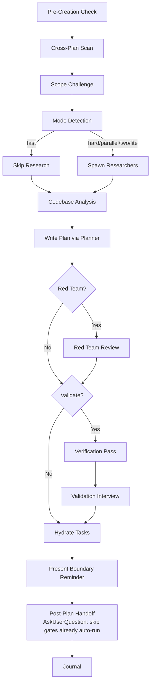

Enable Ultrathink

# Planning

Create detailed technical implementation plans through research, codebase analysis, solution design, and comprehensive documentation.

**IMPORTANT:** Before you start, scan unfinished plans in the current project at `./.claude/tasks/[task-id]/plan/` directory, read the `plan.md`, if there are relevant plans with your upcoming plan, update them as well. If you're unsure or need more clarifications, use `AskUserQuestion` tool to ask the user.

### Cross-Plan Dependency Detection

During the pre-creation scan, detect and mark blocking relationships between plans:

1. **Scan** — Read `plan.md` frontmatter of each unfinished plan (status != `completed`/`cancelled`)
2. **Compare scope** — Check overlapping files, shared dependencies, same feature area
3. **Classify relationship:**
   - New plan needs output of existing plan → new plan `blockedBy: [existing-plan-dir]`
   - New plan changes something existing plan depends on → existing plan `blockedBy: [new-plan-dir]`, new plan `blocks: [existing-plan-dir]`
   - Mutual dependency → both plans reference each other in `blockedBy`/`blocks`
4. **Bidirectional update** — When relationship detected, update BOTH `plan.md` files' frontmatter
5. **Ambiguous?** → Use `AskUserQuestion` with header "Plan Dependency", present detected overlap, ask user to confirm relationship type (blocks/blockedBy/none)

**Frontmatter fields** (relative plan dir paths):
```yaml
blockedBy: [260301-1200-auth-system]     # This plan waits on these plans
blocks: [260228-0900-user-dashboard]     # This plan blocks these plans
```

**Status interaction:** A plan with `blockedBy` entries where ANY blocker is not `completed` → plan status should note `blocked` in its overview. When all blockers complete, the blocked plan becomes unblocked automatically on next scan.

# Default (No Arguments)

If invoked with a task description, proceed with planning workflow. If invoked WITHOUT arguments or with unclear intent, use `AskUserQuestion` to present available operations:

| Operation | Description |
|-----------|-------------|
| `(default)` | Create implementation plan for a task |
| `archive` | Write journal entry & archive plans |
| `red-team` | Adversarial plan review |
| `validate` | Critical questions interview |

Present as options via `AskUserQuestion` with header "Planning Operation", question "What would you like to do?".

## Workflow Modes

Default: auto-detect planning mode (analyze task complexity and pick mode).

| Flag | Mode | Research | Red Team | Validation | Cook Flag |
|------|------|----------|----------|------------|-----------|
| `--auto` | Auto-detect | Follows mode | Follows mode | Follows mode | Follows mode |
| `--fast` | Fast | Skip | Skip | Skip | (none) |
| `--hard` | Hard | 2 researchers | Yes | Optional | (none) |
| `--parallel` | Parallel | 2 researchers | Yes | Optional | `--parallel` |
| `--two` | Two approaches | 2+ researchers | After selection | After selection | (none) |
| `--lite` | Lite | Skip | Skip | Skip | `--auto` |

Add `--no-tasks` to skip task hydration in any mode.

Load: `references/workflow-modes.md` for auto-detection logic, per-mode workflows, context reminders.

**Lite mode (`--lite`):** Load `references/lite.md` — no research, max 4 phases, single plan file.

## When to Use

- Planning new feature implementations
- Architecting system designs
- Evaluating technical approaches
- Creating implementation roadmaps
- Breaking down complex requirements

## Core Responsibilities & Rules

Always honoring **YAGNI**, **KISS**, and **DRY** principles.
**Be honest, be brutal, straight to the point, and be concise.**

### 1. Research & Analysis
Load: `references/research-phase.md`
**Skip if:** Fast mode or provided with researcher reports

### 2. Codebase Understanding
Load: `references/codebase-understanding.md`
**Skip if:** Provided with scout reports

### 2a. API Patterns & Code Review Phase
Load: `references/api-patterns.md` — API detection signals, schema-first/code-first patterns, mandatory code review phase template.

### 2b. Database Migration Approach Detection
When the task involves schema changes (tables, columns, indexes, relations): detect `db-approach` in Step 4b of `references/codebase-understanding.md`.
**If `migration-based`:** plan must include migration file generation — never direct schema edits alone. If `code-first-push`: schema file edits are the primary artifact.

### 3. Solution Design
Load: `references/solution-design.md`

### 4. Plan Creation & Organization
Load: `references/plan-organization.md`

### 5. Task Breakdown & Output Standards
Load: `references/output-standards.md`

## Process Flow (Authoritative)



**This diagram is the authoritative workflow.** Prose sections below provide detail for each node.

## Workflow Process

1. **Pre-Creation Check** → Check Plan Context for active/suggested/none
1b. **Cross-Plan Scan** → Scan unfinished plans, detect `blockedBy`/`blocks` relationships, update both plans
1c. **Scope Challenge** → Run Step 0 scope questions, select mode (see `references/scope-challenge.md`)
    **Skip if:** `--fast` mode or trivial task
2. **Mode Detection** → Auto-detect or use explicit flag (see `workflow-modes.md`)
3. **Research Phase** → Spawn researchers (skip in fast mode)
4. **Codebase Analysis** → Read docs, scout if needed
5. **Plan Documentation** → Write comprehensive plan via planner subagent
6. **Red Team Review** → Run `/devkit:plan red-team {plan-path}` (hard/deep/parallel/two modes)
7. **Post-Plan Validation** → Run `/devkit:plan validate {plan-path}` (hard/deep/parallel/two modes)
8. **Hydrate Tasks** → Create Claude Tasks from phases (default on, `--no-tasks` to skip)
9. **Boundary Reminder** → Present optional next-step commands with absolute path

### Whole-Plan Consistency Gate

This gate is mandatory after `/devkit:plan validate` or `/devkit:plan red-team` edits any plan file.
Load: `references/verification-roles.md` → "Whole-Plan Consistency Sweep".

Before recommending `/devkit:cook`, re-read `plan.md` and every `phase-*.md` file. Search all plan files for stale terms, rejected assumptions, renamed APIs/files/fields, superseded decisions, and duplicate embedded drafts/contracts. Reconcile contradictions across the entire plan, not only the edited phase.

If unresolved contradictions remain, report them and ask the user. Do not recommend cook until the whole-plan consistency sweep reports zero unresolved contradictions.

## Output Requirements

- DO NOT implement code - only create plans
- DO NOT include tests in plans (testing is handled separately via `/devkit:test`)
- Respond with plan file path and summary
- Ensure self-contained plans with necessary context
- Include code snippets/pseudocode when clarifying
- Fully respect the `./docs/development-rules.md` file

## Task Management

Plan files = persistent. Tasks = session-scoped. Hydration bridges the gap.

**Default:** Auto-hydrate tasks after plan files are written. Skip with `--no-tasks`.
**3-Task Rule:** <3 phases → skip task creation.
**Fallback:** Task tools (`TaskCreate`/`TaskUpdate`/`TaskGet`/`TaskList`) are CLI-only — unavailable in VSCode extension. If they error, use `TodoWrite` for tracking. Plan files remain the source of truth; hydration is an optimization, not a requirement.

Load: `references/task-management.md` for hydration pattern, TaskCreate patterns, cook handoff protocol.

### Hydration Workflow
1. Write plan.md + phase files (persistent layer)
2. TaskCreate per phase with `addBlockedBy` chain
3. TaskCreate for critical/high-risk steps within phases
4. Metadata: phase, priority, effort, planDir, phaseFile
5. Cook picks up via TaskList (same session) or re-hydrates (new session)

## Active Plan State

Check `## Plan Context` injected by hooks:
- **"Plan: {path}"** → Active plan. Ask "Continue? [Y/n]"
- **"Suggested: {path}"** → Branch hint only. Ask if activate or create new.
- **"Plan: none"** → Create new using `Plan dir:` from `## Naming`

**Task-ID Resolution Order:**
1. From `$ARGUMENTS` (if provided)
2. From `$DEVKIT_TASK_ID` env var (set by session hooks)
3. From `## Plan Context` hooks (active task path)
4. Via `AskUserQuestion` (ask user)

After creating plan: `node .claude/scripts/set-active-task.cjs {task-id}`
Reports: Active plans → plan-specific path. Suggested → default path.

**Git Optional:** If git commands fail, skip silently — use "unknown" as branch name. Use `2>/dev/null` with fallbacks; do not throw errors.

### Important
**DO NOT** create plans or reports in USER directory.
**MUST** create plans or reports in **THE CURRENT WORKING PROJECT DIRECTORY**.

## Subcommands

| Subcommand | Reference | Purpose |
|------------|-----------|---------|
| `/devkit:plan archive` | `references/archive-workflow.md` | Archive plans + write journal entries |
| `/devkit:plan red-team` | `references/red-team-workflow.md` | Adversarial plan review with hostile reviewers |
| `/devkit:plan validate` | `references/validate-workflow.md` | Validate plan with critical questions interview |

## Post-Plan Handoff (MANDATORY at session end)

After `plan.md` + phase files are written and the user has reviewed/approved them, use `AskUserQuestion` to offer the appropriate next step. Recommend the option that best fits the plan's risk/scope; recommended option listed FIRST and labelled "(Recommended)".

| Option | Recommend When | Why |
|--------|----------------|-----|
| `/devkit:plan validate` | Plan is moderate-to-complex; user wants critical-questions interview before implementation | Cheapest gate — surfaces unspecified assumptions, missing acceptance criteria, hand-wavy phases |
| `/devkit:plan red-team` | Plan touches security, auth, payments, data integrity, public APIs, infra, or has high blast radius | Adversarial reviewers stress-test the plan for failure modes, attack vectors, and missing edge cases |
| `/devkit:cook <plan-path>` | Plan is small / well-understood / low-risk and user wants to start implementation | Skip extra gates; go straight to implementation |
| End session | User wants to review/share plan before deciding | Stop with plan path returned |

**Skip this step ONLY when:**
- The current invocation IS already a subcommand (`validate`, `red-team`, `archive`) — those have their own terminal handoff.
- User explicitly said "just plan, don't suggest next step".

**Skip an individual option ONLY when the active mode already auto-ran that gate (per Workflow Process Steps 6-7):**
- Omit `/devkit:plan red-team` from the offered options when mode is `--hard`, `--deep`, `--parallel`, or `--two` (Step 6 already ran adversarial review).
- Omit `/devkit:plan validate` from the offered options when mode is `--deep` (Step 7 already ran validation).
- If both gates already ran, the Post-Plan Handoff still fires but offers only `/devkit:cook <plan-path>` and `End session`.

After selection: invoke the chosen command with the plan path as argument for continuity.

## Quality Standards

- Thorough and specific, consider long-term maintainability
- Research thoroughly when uncertain
- Address security and performance concerns
- Detailed enough for junior developers
- Validate against existing codebase patterns

**Remember:** Plan quality determines implementation success. Be comprehensive and consider all solution aspects.

## Workflow Position

**Typically follows:** `/devkit:brainstorm` (after exploring options), `/scout` (after codebase discovery)
**May precede:** `/devkit:cook` after user approval (otherwise stop with plan path and next-step options)
**Related:** `/devkit:brainstorm` (explore before planning), `/devkit:cook` (execute after planning)
