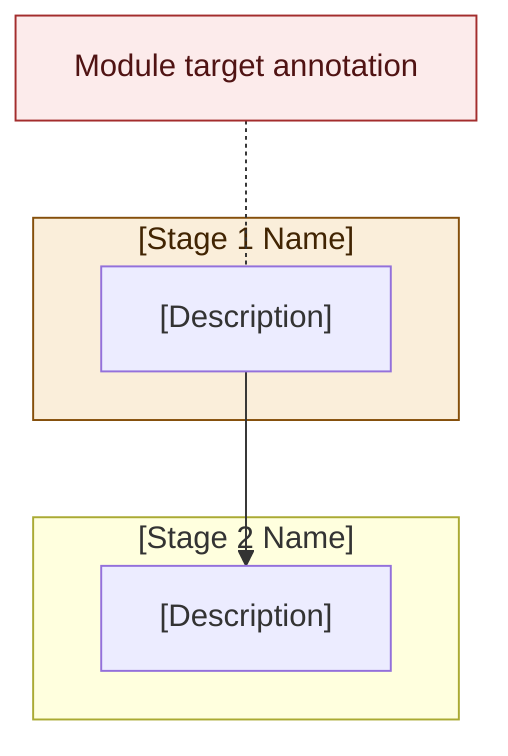
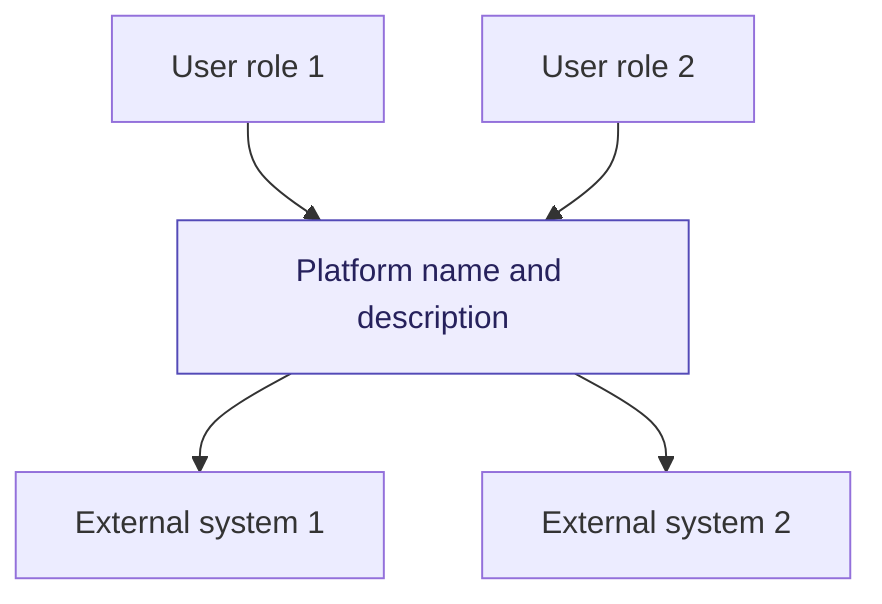
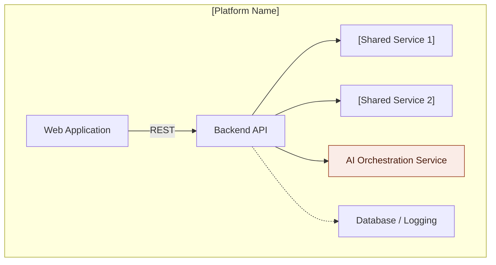
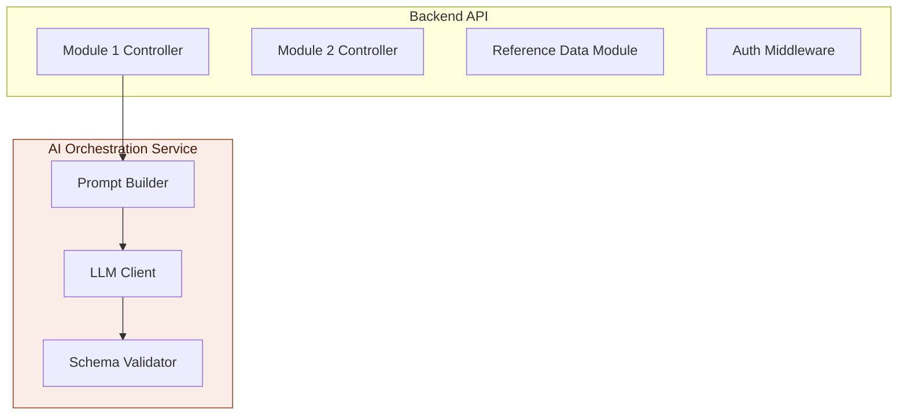
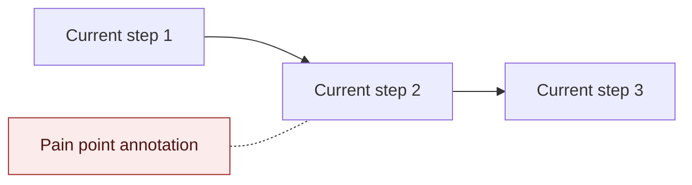
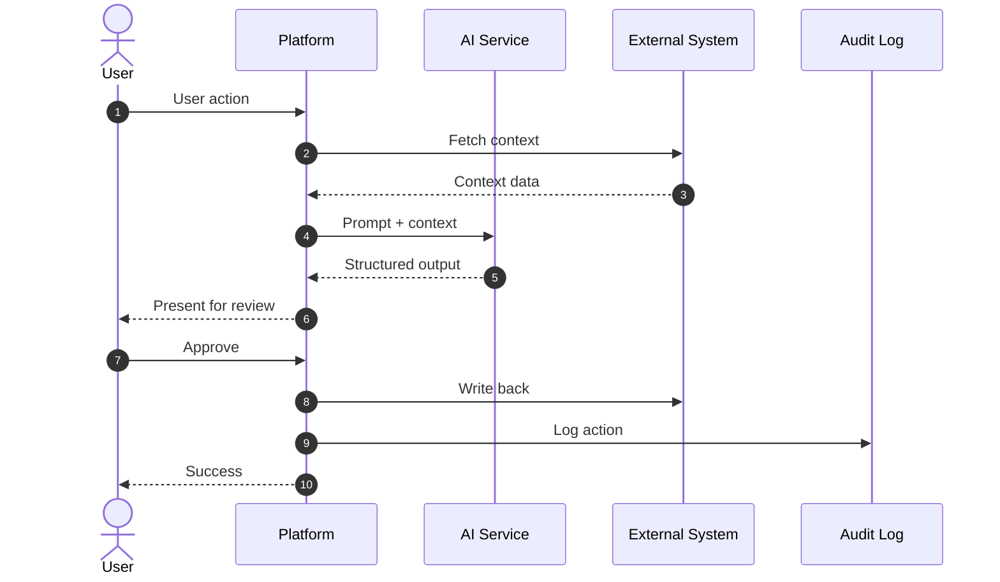
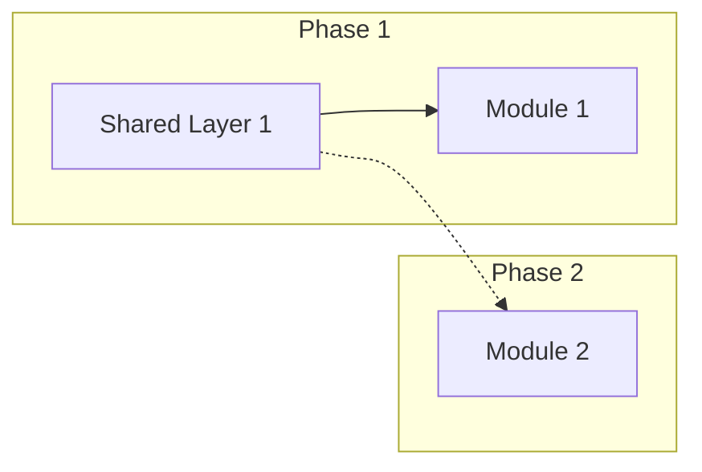

# [Client Name] — [Project Name] Visual Brief

**Source:** [Client's brief/document title and version]
**Prepared by:** Enouvo IT Solutions — Solution Architecture Team
**Client:** [Industry], [Location] — [team size] staff
**Primary system:** [Existing systems the client uses]
**Proposed stack:** [AI/backend/frontend choices]
**Hosting:** [Cloud region]

---

## How to Use This Template

> **This is a reusable proposal template for presale solution architecture documents.** Replace all `[PLACEHOLDER]` text with project-specific content. Remove this instruction block before delivering to stakeholders.
>
> **Rules:**
> 1. Every data point must cite its source in the client's brief — never guess
> 2. Clearly label what comes from the client vs what is our recommendation
> 3. Use Mermaid diagrams — avoid ` `, em dashes (`—`), and arrows (`→`) inside sequence diagram participant names and messages
> 4. Ask business questions, not technical ones — the client is a domain expert, not an engineer
> 5. Verify the final document against the client's brief before delivery (see verification checklist at end)

---

## 0. Project Introduction

### The Client

[1-2 sentences: who they are, where, industry, team size. Only facts from their brief.]

### Current Systems & Tools

[List every system/tool mentioned in the client's brief with its role. Flag any that are being replaced or decommissioned.]

| System | Role | Source | Notes |
|---|---|---|---|
| **[System 1]** | [What it does for the client] | [Brief section ref] | |
| **[System 2]** | [What it does for the client] | [Brief section ref] | [e.g., "To be decommissioned"] |
| ... | | | |

### Client Roles

[List every role mentioned in the brief with their documented responsibilities. Do NOT invent roles not in the brief.]

| Role | Responsibilities (from brief) |
|---|---|
| **[Role 1]** | [What the brief says they do] |
| **[Role 2]** | [What the brief says they do] |
| ... | |

### Key Business Data

[Extract every measurable data point from the brief. Each row must have a source citation.]

| Data point | Value | Source |
|---|---|---|
| Team size | [number] | [ref] |
| [Key metric 1] | [value] | [ref] |
| [Key metric 2] | [value] | [ref] |
| [Failure rate / pain metric] | [value] | [ref] |
| ... | | |

### The Problem — All Friction Points

[List every friction point / pain point identified in the brief, in the client's priority order. Include current process, failure mode, and which module addresses it.]

| Priority | Friction Point | Current Process | Failure Mode | Module Target |
|---|---|---|---|---|
| **#1** | [Highest pain] | [How they do it now] | [What goes wrong] | **M1** |
| **#2** | [Second pain] | [How they do it now] | [What goes wrong] | **M2** |
| ... | | | | |

### The Solution

[2-3 paragraphs from the brief describing the platform concept, module structure, tech ecosystem preference, and mandatory constraints.]

> **Technology decisions (our recommendations — to be confirmed in scoping response):**
> - **[Category 1]:** We recommend [choice]. The brief asks the developer to evaluate [options from brief]. The scoping response must address why [alternative] was not selected.
> - **[Category 2]:** We recommend [choice]. The brief also lists [alternatives].
> - ...

### Design Principle

> [Verbatim quote from client's brief if one exists. Otherwise summarize their architectural philosophy.]

### Technical Constraints

[Every constraint stated in the brief with source citation.]

| Constraint | Detail | Source |
|---|---|---|
| **[Constraint 1]** | [Detail] | [ref] |
| **[Constraint 2]** | [Detail] | [ref] |
| ... | | |

### Product Outcomes

| # | Module | What the client gets | What it replaces |
|---|---|---|---|
| **1** | [Module name] | [Outcome] | [Current state] |
| **2** | [Module name] | [Outcome] | [Current state] |
| ... | | | |

### Scoping Response Requested

[Reproduce the client's scoping/response requirements verbatim. Add our notes in italics where we have already formed a recommendation.]

1. [Client's item 1 verbatim]. *Our note if applicable.*
2. [Client's item 2 verbatim]. *Our note if applicable.*
3. ...

---

## 1. User Flow — Business Lifecycle

[Document the client's current business process step by step. Every stage from the brief gets its own sub-section with description, diagram, and module callout.]

### 1.1 Overview Flow

[High-level Mermaid flowchart showing all stages, with module targets annotated as callout nodes.]

### 1.2 Stage Details

[One sub-section per business process stage from the brief. Include:]
- Description (from brief)
- Detailed decision-tree flowchart (if the stage has branching logic)
- Module callout block quote identifying the friction and target module

#### [Stage Name]

[Description from brief]

> **[Color] Module [N] target.** [Friction description]. [Why it matters].

### 1.3 Friction Point Summary

| Priority | Stage | Friction | Failure frequency | Module |
|---|---|---|---|---|
| **#1** | [Stage] | [Friction] | [Frequency from brief] | M[N] |
| ... | | | | |

---

## 2. C4 Model

### 2.1 C1 — System Context

[Highest-level view: users, the platform as one box, and all external systems.]

### 2.2 C2 — Container Diagram

[Zoom into the platform: web app, backend API, shared services, databases.]

### 2.3 C3 — Component Diagram

[Zoom into backend API and AI service: controllers, services, middleware.]

**Key points (our architectural recommendations — client brief is technology-agnostic unless stated otherwise):**
- [Architecture decision 1 and rationale]
- [Architecture decision 2 and rationale]

---

## 3. Platform Architecture

[Mermaid diagram showing external systems, shared layers, and modules with connections.]

> **Design Principle:** [Verbatim or summarized from client brief]

---

## 4. System Architecture Diagram

[Detailed Mermaid diagram showing all components within the data residency boundary, including external system connections, audit logging flows.]

---

## 5. Modules

[One sub-section per module. Every module follows the same structure template below.]

### 5.[N] Module [N]: [Module Name]

**Priority:** #[N]
**Phase:** [Phase number]
**AI required:** [Yes/No — if yes, which services]
**Key integration:** [Which external systems this module connects to]
**[Other key notes]:** [e.g., "Decommission: [old system] must be disabled"]

#### Description

[2-3 paragraphs: what this module does, what problem it solves, what the current workflow looks like, and what changes.]

#### [Current Workflow — if replacing an existing process]

[Optional: Mermaid flowchart showing the current workflow being replaced, with pain points annotated.]

#### Sequence Diagram

[Mermaid sequence diagram showing the new workflow end-to-end. Include: user actions, platform processing, AI calls, external system interactions, audit logging.]

#### [Data Schema — if the module produces structured output]

[Table or Mermaid classDiagram showing the output schema with field descriptions.]

| Field | Type | Description |
|---|---|---|
| `field_1` | String | [Description] |
| `field_2` | Boolean | [Description] |
| ... | | |

#### [System Prompt Design — if the module uses AI]

[Numbered list of what the system prompt must include, sourced from client brief.]

1. **Role:** [Role definition]
2. **Context:** [What context is injected]
3. **Output format:** [Schema reference]
4. **Rules:** [Critical business rules the AI must follow]
5. **No fabrication:** Do not infer facts not present in the source

#### Key Rules

[Bullet list of non-negotiable rules from the client's brief, with source citations.]

- [Rule 1 — source ref]
- [Rule 2 — source ref]
- ...

#### Open Questions for Client

[Table of questions specific to this module that must be answered before architecture is finalized.]

| # | Question | Impact |
|---|---|---|
| [ID] | [Question in plain language] | [What it affects in the build] |
| ... | | |

---

*[Repeat Section 5.[N] template for each module]*

---

### 5.[N+1] Module Dependency & Build Roadmap

[Mermaid graph showing which modules depend on which shared layers, and the phase grouping.]

### 5.[N+2] [External System] Integration Research

> **Note:** The information below is from **our independent research** — not from the client's brief. The brief directs the developer to review [system] documentation.

[Research findings: confirmed API capabilities, constraints, pricing, onboarding requirements.]

| Capability | Endpoint / Detail | Status |
|---|---|---|
| [Capability 1] | [Detail] | ✅ Confirmed |
| [Capability 2] | [Detail] | ✅ Confirmed |
| ... | | |

### 5.[N+3] AI Invocation Registry

[Table mapping every point in the platform where AI is called.]

| ID | Module | Invocation | Service | Model |
|---|---|---|---|---|
| 1.1 | M1 | [What AI does] | [Service] | [Model] |
| 1.2 | M1 | [What AI does] | Rule-based | N/A |
| ... | | | | |

### 5.[N+4] Responsibility Matrix

[Aggregated table showing deliverable counts by discipline per module.]

| Module | Total | Backend | Frontend | AI |
|---|:---:|:---:|:---:|:---:|
| M1 | [N] | [N] | [N] | [N] |
| M2 | [N] | [N] | [N] | [N] |
| ... | | | | |
| **TOTAL** | **[N]** | **[N]** | **[N]** | **[N]** |

---

## 6. Dependency Matrix

[Cross-reference table: modules vs shared layers/services.]

| Module | [Layer 1] | [Layer 2] | [Layer 3] | [AI Service] | [Other] |
|---|:---:|:---:|:---:|:---:|:---:|
| **M1** | ✓ | ✓ | — | ✓ | — |
| **M2** | ✓ | — | ✓ | ✓ | — |
| ... | | | | | |

---

## 7. Known Constraints & Open Questions

### 7.1 Data Privacy & Security

| Requirement | Detail |
|---|---|
| [Requirement 1] | [Detail from brief] |
| [Requirement 2] | [Detail from brief] |
| ... | |

### 7.2 Customer Discovery Questions

> **Context:** Technical decisions are driven by us. The questions below focus on **business logic, workflows, volumes, and edge cases** that we cannot infer from the brief alone. These answers directly shape how we scope, estimate, and build.

[Organize questions by topic. Each question has: ID, plain-language question (non-technical), and "Why we need this" explaining the business impact.]

#### A. Volumes & Scale

| # | Question | Why we need this |
|---|---|---|
| A-01 | [Volume question] | [Impact on build] |
| ... | | |

#### B. [Module 1 Topic]

| # | Question | Why we need this |
|---|---|---|
| B-01 | [Workflow detail question] | [Impact on build] |
| ... | | |

#### C. [Module 2 Topic]

*[Continue for each module and cross-cutting topic...]*

#### [X]. Priorities, Budget & Timeline

| # | Question | Why we need this |
|---|---|---|
| [X]-01 | Target go-live date? External deadlines? | Milestone planning |
| [X]-02 | Budget range for initial build? Total platform? | Scope appropriately |
| [X]-03 | Ongoing support or build-and-handover? | Delivery model |
| [X]-04 | Feedback cadence? Weekly demos? UAT? Internal champion? | Delivery process |
| [X]-05 | Single point of contact during development? | Communication structure |

### 7.3 Question Summary

| Category | Questions | Key dependency |
|---|---|---|
| A. Volumes | [N] | Cost model, sizing |
| B. [Module 1] | [N] | [Dependency] |
| ... | | |
| **TOTAL** | **[N]** | |

---

## 8. Feature List

[Enumerate every feature with ID, description, layer/module, and phase. Organize by shared platform features first, then by module.]

### Shared Platform Features

| ID | Feature | Layer | Phase |
|---|---|---|---|
| P-01 | [Feature] | [Layer] | [Phase] |
| ... | | | |

### Module [N] Features

| ID | Feature | Phase |
|---|---|---|
| M[N]-01 | [Feature] | [Phase] |
| ... | | |

*[Repeat for each module]*

### Feature Summary

| Category | Count |
|---|---|
| Shared platform | [N] |
| M1 | [N] |
| M2 | [N] |
| ... | |
| **TOTAL** | **[N]** |

---

## 9. Scoping Response Checklist

[Reproduce the client's scoping requirements verbatim from their brief. Add our notes in italics.]

1. ☐ [Client's item 1]. *Our note.*
2. ☐ [Client's item 2]. *Our note.*
3. ...

---

*Generated from [Client Brief Title and Version]. All technology choices are our recommendations unless stated otherwise.*

---

## Appendix: Pre-Delivery Verification Checklist

Before delivering this document, verify against the client's brief:

| # | Check | Status |
|---|---|---|
| 1 | Every module matches the client's priority order | ☐ |
| 2 | Every data point has a source citation from the brief | ☐ |
| 3 | No facts invented / hallucinated — every claim traceable | ☐ |
| 4 | Our recommendations clearly labeled as "our recommendation" | ☐ |
| 5 | Client's original options acknowledged (even if we chose one) | ☐ |
| 6 | Scoping checklist matches client's brief verbatim | ☐ |
| 7 | All Mermaid diagrams render (no special chars in sequence diagrams) | ☐ |
| 8 | No carryover from previous project versions (if brief was updated) | ☐ |
| 9 | Privacy/security requirements from brief fully captured | ☐ |
| 10 | Decommission requirements captured (if replacing existing systems) | ☐ |
| 11 | Customer discovery questions are business-focused, not technical | ☐ |
| 12 | Feature list covers all modules + shared platform | ☐ |
| 13 | Responsibility matrix accounts for all modules | ☐ |
| 14 | Dependency matrix covers all shared layers | ☐ |
